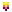
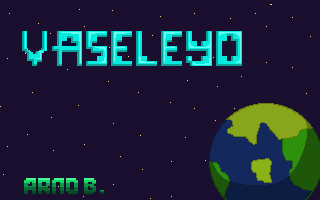

# M14 Introducció a Python

Benvinguts al meu repository de Python.

## Els meus programes
### Exercicis de classe
- [Hello World](hello_world.py)
- [Nùmero factorial amb funció break](factorial.py)
- [Nùmero factorial amb "for"](factorialfor.py)
- [Taula de multiplicació amb "for"](multiplicacionumero.py)
- [Pregunta de DNI](preguntaDNI.py)
- [Verificació de nùmero de telefon](verificacionumero.py)
- [Concatenar paraules](concatenacio.py)
- [PyCalc (Calculadora interactiva)](pycalc.py)
- [Definicions i aleatori](daus.py)
- [Joc amb les definicions](joc.py)
- [Cara pygame](Pygame/Practica/cara.py)
### Bateria de programes
#### Bateria 1 - variables
- [Bateria 1.1](bateria%201-1.py)
- [Bateria 1.2](bateria1-2.py)
- [Bateria 1.3](bateria1-3.py)
- [Bateria 1.4](bateria1-4.py)
- [Bateria 1.5](bateria%201-5.py)
#### Bateria 2 - if
- [Bateria 2.1](bateria2-1.py)
- [Bateria 2.2](bateria2-2.py)
- [Bateria 2.3](bateria2-3.py)
- [Bateria 2.4](bateria2-4.py)
- [Bateria 2.5](bateria2-5.py)
#### Bateria 3 - while
- [Bateria 3.1](bateria3-1.py)
- [Bateria 3.2](bateria3-2.py)
- [Bateria 3.3](bateria3-3.py)
- [Bateria 3.4](bateria3-4.py)
- [Bateria 3.5]()

#### Bateria 4 - for
- [Bateria 4.1](bateria4-1.py)

#### Bateria 5 - Llistes (arrays)
- [Bateria 5.1](bateria5-1.py)
- [Bateria 5.2](bateria5-2.py)

## Projecte pygame
### Sprites
#### Nau protagonista

##### Trets nau protagonista
<table>
  <tr>
<td></td>
<td></td>
    </tr>
</table>

#### Backgrounds
##### Pantalla de títol

